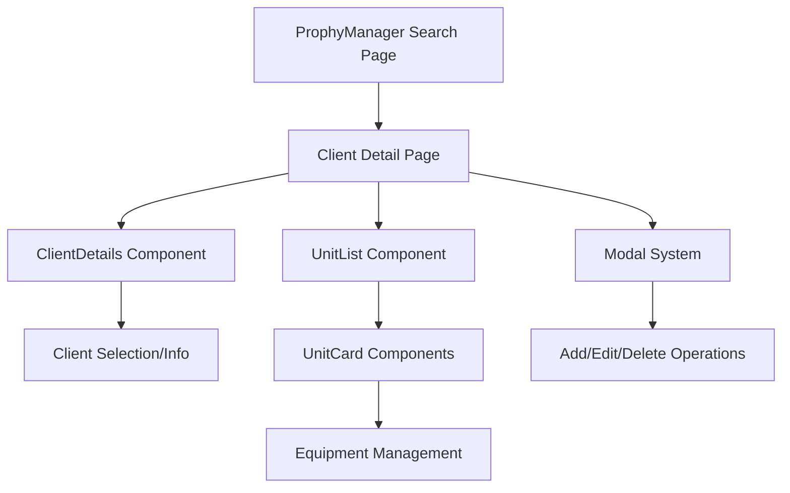

# 📋 Implementation Plan: ProphyManager Client Detail Page

## 🔍 Analysis Summary

### Current Structure

-   **internalMedicalPhysicist page**: Full client management with `ClientDetails` + `UnitList` components
-   **prophyManager page**: Search interface with empty `handleViewDetails` function (line 252)
-   **Routing**: Next.js parallel routes using `@roleName` convention
-   **Data Loading**: `useClientDataLoading` hook for multi-client management

### Key Components Architecture



## 🏗️ Implementation Plan

### 1. File Structure & Routing

**New Files to Create:**

```
frontend/app/dashboard/@prophyManager/
├── client/
│   └── [cnpj]/
│       └── page.tsx                    # Main client detail page
├── hooks/
│   └── use-single-client-loading.ts    # Custom hook for single client
└── components/
    └── ClientDetailHeader.tsx          # Navigation header component
```

**Routing Strategy:**

-   **Detail Page URL**: `/dashboard/client/{cnpj}`
-   **Navigation**: Update `handleViewDetails` to navigate to detail page
-   **Back Navigation**: Custom header with back button returning to search page

### 2. Data Loading Strategy

**New Custom Hook**: `use-single-client-loading.ts`

```typescript
// Based on useClientDataLoading but for single client
export function useSingleClientLoading(cnpj: string) {
    // Use existing useGetByCnpjQuery API
    // Load related units and operations
    // Return similar structure to useClientDataLoading
}
```

**Key Differences from `useClientDataLoading`**:

-   Load single client by CNPJ using `useGetByCnpjQuery`
-   No client selection dropdown needed
-   Fixed client context throughout the page

### 3. Component Adaptations

**Reusable Components:**

-   ✅ `ClientDetails` - Adapt to hide client selector
-   ✅ `UnitList` - No changes needed
-   ✅ `UnitCard` - No changes needed
-   ✅ All modal components and forms - No changes needed

**Component Modifications:**

-   **ClientDetails**: Add prop to disable client selection dropdown
-   **New ClientDetailHeader**: Navigation breadcrumb with back button

### 4. Permission & Role Handling

**ProphyManager Permissions:**

-   Full access like internalMedicalPhysicist (confirmed by user)
-   Reuse existing permission checks in `UnitCard` and `ClientDetails`
-   Staff permissions: `userData?.role === "GP"` (already implemented)

### 5. Navigation Implementation

**handleViewDetails Update:**

```typescript
const handleViewDetails = (cnpj: string) => {
    router.push(`/dashboard/client/${cnpj}`);
};
```

**Back Navigation Strategy:**

-   Custom header component with back button
-   Preserve search filters in URL when navigating back
-   Use router history for seamless navigation

## 🔧 Implementation Details

### Phase 1: Core Infrastructure

1. **Create custom hook** `use-single-client-loading.ts`
2. **Update prophyManager search page** - Implement `handleViewDetails`
3. **Create routing structure** - Add `client/[cnpj]/page.tsx`

### Phase 2: Component Development

1. **Create ClientDetailHeader** - Navigation breadcrumb component
2. **Adapt ClientDetails** - Add `hideClientSelector` prop
3. **Create main detail page** - Combine all components

### Phase 3: Integration & Testing

1. **Test navigation flow** - Search → Detail → Back
2. **Verify permissions** - All operations work for prophyManager
3. **Test with real data** - CNPJ parameter handling

## 📁 Implementation Structure

### Main Detail Page Template

```typescript
// frontend/app/dashboard/@prophyManager/client/[cnpj]/page.tsx
"use client";

import { useParams } from "next/navigation";
import { useSingleClientLoading } from "../../hooks/use-single-client-loading";
import { ClientDetails, UnitList } from "@/components/client";
import { ClientDetailHeader } from "../../components/ClientDetailHeader";
// ... other imports similar to internalMedicalPhysicist

function ClientDetailPage() {
    const params = useParams();
    const cnpj = params.cnpj as string;

    // Use custom hook instead of useClientDataLoading
    const {
        isLoading,
        hasNoData,
        client,
        filteredUnits,
        // ... other data
    } = useSingleClientLoading(cnpj);

    // Similar structure to internalMedicalPhysicist page
    // but with fixed client context
}
```

### Custom Hook Structure

```typescript
// frontend/app/dashboard/@prophyManager/hooks/use-single-client-loading.ts
export function useSingleClientLoading(cnpj: string) {
    const { data: clientsData } = useGetByCnpjQuery({ cnpj, page: 1 });
    const client = clientsData?.results?.[0];

    // Load units for specific client
    // Load operations for specific client
    // Return structured data similar to useClientDataLoading
}
```

### Navigation Header Component

```typescript
// frontend/app/dashboard/@prophyManager/components/ClientDetailHeader.tsx
import { useRouter } from "next/navigation";
import { ArrowLeft } from "@phosphor-icons/react";
import { Button } from "@/components/common";
import { Typography } from "@/components/foundation";

function ClientDetailHeader({ clientName, cnpj }: { clientName: string; cnpj: string }) {
    const router = useRouter();

    const handleBack = () => {
        router.back(); // Or router.push('/dashboard') to return to search
    };

    return (
        <div className="mb-6">
            <Button variant="secondary" onClick={handleBack} className="mb-4">
                <ArrowLeft size={16} /> Voltar à busca
            </Button>
            <Typography element="h1" size="title1" className="font-bold">
                {clientName} - {cnpj}
            </Typography>
        </div>
    );
}
```

## 🎯 Key Benefits

1. **🔄 Component Reuse**: 95% of existing components can be reused
2. **🚀 Consistent UX**: Same interface as internalMedicalPhysicist
3. **🔐 Full Permissions**: ProphyManager gets complete access
4. **📱 Responsive Design**: Inherits existing responsive layout
5. **🔗 Seamless Navigation**: Smooth flow between search and detail
6. **⚡ Performance**: Targeted data loading for single client

## 📋 Implementation Checklist

### Files to Create:

-   [ ] `frontend/app/dashboard/@prophyManager/client/[cnpj]/page.tsx`
-   [ ] `frontend/app/dashboard/@prophyManager/hooks/use-single-client-loading.ts`
-   [ ] `frontend/app/dashboard/@prophyManager/components/ClientDetailHeader.tsx`

### Files to Modify:

-   [ ] `frontend/app/dashboard/@prophyManager/page.tsx` - Update `handleViewDetails` function
-   [ ] `frontend/app/components/client/ClientDetails.tsx` - Add optional prop to hide client selector

### API Integration:

-   [ ] Utilize existing `useGetByCnpjQuery` for single client loading
-   [ ] Reuse all existing API slices and operations
-   [ ] Maintain same data flow patterns as internalMedicalPhysicist

### Testing Requirements:

-   [ ] Navigation from search to detail page works
-   [ ] Back navigation preserves search state
-   [ ] All CRUD operations work for prophyManager role
-   [ ] Modal systems function correctly
-   [ ] Responsive design works on all screen sizes
-   [ ] Error handling for invalid CNPJ parameters

## 🔧 Technical Considerations

### URL Structure:

-   Search Page: `/dashboard` (prophyManager role)
-   Detail Page: `/dashboard/client/[cnpj]`
-   Unit Detail: `/dashboard/unit/[id]` (existing, no changes needed)

### State Management:

-   Use existing Redux slices and API endpoints
-   Maintain modal state management system
-   Preserve operation status tracking

### Error Handling:

-   Invalid CNPJ parameter handling
-   Client not found scenarios
-   Network error recovery
-   Permission validation

### Performance:

-   Targeted data loading for single client
-   Efficient API calls using existing endpoints
-   Proper loading states and error boundaries

This implementation plan ensures full feature parity with internalMedicalPhysicist while maintaining clean architecture and optimal user experience for the prophyManager role.
